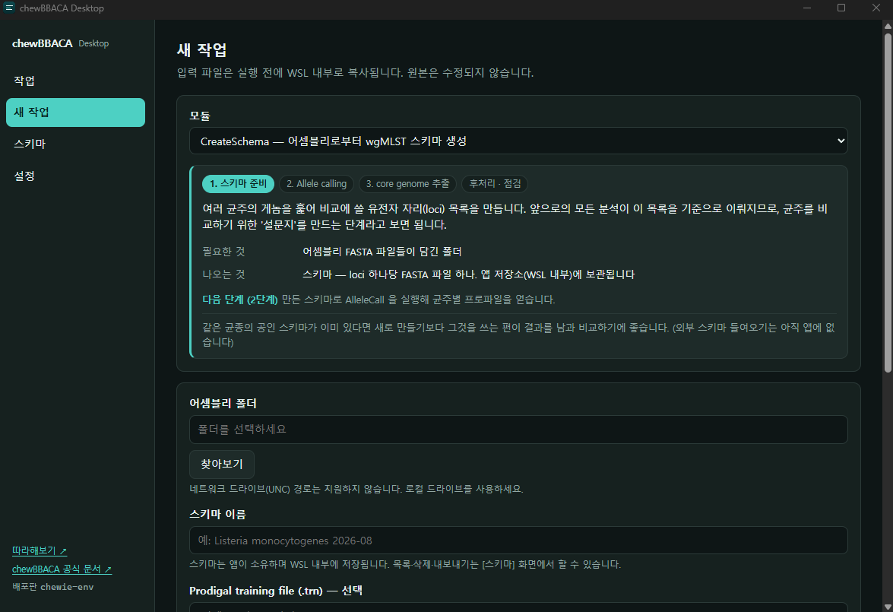

# chewBBACA Desktop

터미널 경험이 없는 연구자를 위한 [chewBBACA](https://github.com/B-UMMI/chewBBACA) 데스크톱 앱.
세균 cg/wgMLST 스키마 생성과 allele calling 을 Windows 에서 클릭으로 실행합니다.

명령줄도, Linux 도, 별도 설치도 필요 없습니다. 분석 엔진(chewBBACA 3.5.4)이 인스톨러 안에
함께 들어 있고, 앱이 알아서 전용 실행 환경을 준비합니다.

**[최신 버전 내려받기 →](https://github.com/s4ng/chew-bbaca-gui/releases/latest)**

---

## 할 수 있는 것

chewBBACA 의 여덟 모듈을 화면에서 실행합니다. 모듈을 고르면 **그 단계가 파이프라인의
어디쯤인지, 무엇을 넣고 무엇이 나오는지**를 함께 보여줍니다.

| 단계 | 모듈 | 하는 일 |
| --- | --- | --- |
| 1. 스키마 준비 | [CreateSchema](https://chewbbaca.readthedocs.io/en/latest/user/modules/CreateSchema.html) | 어셈블리 모음에서 비교에 쓸 유전자 자리(loci) 목록을 만듭니다 |
| | [PrepExternalSchema](https://chewbbaca.readthedocs.io/en/latest/user/modules/PrepExternalSchema.html) | 이미 있는 외부 스키마를 들여옵니다 |
| 2. Allele calling | [AlleleCall](https://chewbbaca.readthedocs.io/en/latest/user/modules/AlleleCall.html) | 균주마다 각 자리의 변종 번호를 매깁니다 |
| 3. core genome 추출 | [ExtractCgMLST](https://chewbbaca.readthedocs.io/en/latest/user/modules/ExtractCgMLST.html) | 모든 균주에 존재하는 자리만 추립니다 |
| 후처리 · 점검 | [RemoveGenes](https://chewbbaca.readthedocs.io/en/latest/user/modules/RemoveGenes.html) · [JoinProfiles](https://chewbbaca.readthedocs.io/en/latest/user/modules/JoinProfiles.html) | 표에서 loci 를 빼거나, 나눠 돌린 결과를 합칩니다 |
| | [SchemaEvaluator](https://chewbbaca.readthedocs.io/en/latest/user/modules/SchemaEvaluator.html) · [AlleleCallEvaluator](https://chewbbaca.readthedocs.io/en/latest/user/modules/AlleleCallEvaluator.html) | 품질 리포트(HTML)를 만들어 브라우저로 엽니다 |

그 밖에:

- **실시간 로그와 진행률** — 지금 어느 단계인지 보이고, [취소] 는 안에서 도는 프로세스까지 정리합니다
- **앱을 닫아도 작업은 계속됩니다** — 다시 켜면 이어받습니다
- **실행 전 점검** — 폴더에 FASTA 가 몇 개인지, 고른 파일이 정말 그 형식인지 미리 알려줍니다.
  잘못 고른 채로 40분을 버리지 않도록
- **스키마 내보내기·불러오기**

---

## 요구사항

- Windows 10/11 (x86_64)
- CPU 가상화 활성화 (BIOS/UEFI)
- WSL2 — 없으면 앱이 설치를 안내합니다
- 디스크 여유 공간 10GB 이상

관리자 권한은 **WSL 설치 단계에서만** 필요합니다. 앱 본체는 현재 사용자 권한으로 설치·실행됩니다.

미리 점검하고 싶다면 [`scripts/check-env.bat`](scripts/check-env.bat) 을 내려받아 더블클릭하세요.

---

## 설치

### 1. 인스톨러 실행

[릴리스](https://github.com/s4ng/chew-bbaca-gui/releases/latest)에서 받은
`chewBBACA Desktop_x.y.z_x64-setup.exe` 를 실행합니다. 파일이 큰 것(약 535MB)은
분석 엔진이 함께 들어 있기 때문입니다.

> **"Windows의 PC 보호" 경고가 뜹니다.** 코드 서명 인증서를 붙이지 않아서이며,
> 파일에 문제가 있다는 뜻은 아닙니다.
> **[추가 정보]** 를 누른 뒤 나타나는 **[실행]** 을 누르세요.

설치 위치는 `%LOCALAPPDATA%\chewBBACA Desktop\` 이고 다른 프로그램에 영향을 주지 않습니다.

### 2. 첫 실행

처음 켜면 실행 환경을 준비하는 화면이 나옵니다. 대부분 **[설치]** 한 번이면 끝나고
1분 이내에 완료됩니다. Windows 기능(WSL)이 없는 PC 라면 안내에 따라 한 번 재부팅해야
할 수 있습니다.

이미 다른 Linux 환경(WSL)을 쓰고 있어도 괜찮습니다. 이 앱은 `chewie-env` 라는
전용 환경만 만들고 기존 것은 건드리지 않습니다.

### 3. 무엇부터 해볼지

왼쪽 아래 **[따라해보기]** 를 누르면 공개 예제 데이터로 전 과정을 따라가는 안내서가
열립니다. 용어 사전도 함께 들어 있습니다.

---

## ChatGPT에게 시키기 (MCP)

앱이 켜져 있는 동안 [MCP](https://modelcontextprotocol.io/) 서버가 함께 돕니다.
ChatGPT 데스크톱 앱 같은 MCP 클라이언트를 등록하면 화면을 직접 조작하는 대신
말로 시킬 수 있습니다.

> *"이 폴더 확인해줘"* · *"그 폴더로 스키마 만들어줘"* · *"작업 다 됐어?"*

- 등록에 필요한 **URL · 헤더 키 · 헤더 값**은 [설정] 화면에서 칸마다 복사할 수 있습니다
- **[연결 방법 보기]** 를 누르면 그림이 든 안내서가 브라우저에서 열립니다
- 서버는 **같은 PC(`127.0.0.1`)에서만** 닿고 토큰으로 보호됩니다. 인터넷에 열리지 않습니다
- **되돌릴 수 없는 조작은 도구로 내놓지 않았습니다** — 스키마 삭제, 실행 환경 제거,
  디스크 정리, 재부팅, 설정 변경은 앱에서만 할 수 있습니다. 체크 하나로 통째로
  읽기 전용으로 만들 수도 있습니다

> **ChatGPT 데스크톱 앱에서는 대화창을 `Work` 모드로 바꿔야 도구가 보입니다.**
> `Chat` 모드에서는 등록이 정확해도 "그런 도구가 없다"고 답합니다.

---

## 지울 때

설정 → 앱 및 기능에서 제거합니다. 제거 창의 **[모든 데이터 삭제]** 를 체크하면
분석 환경과 만들어둔 스키마까지 함께 지워집니다. 스키마를 남기고 싶으면 체크하지 마세요.

---

## 라이선스와 인용

chewBBACA 는 **GPLv3** 입니다. 본 프로젝트는 별도 프로세스로 호출하는 래퍼이며 오픈소스로
공개합니다. rootfs 에 GPL 소프트웨어를 포함해 배포하므로 각 패키지의 upstream 소스 취득
경로를 릴리스 노트에 명시합니다.

> Mamede R, Vila-Cerqueira P, Carriço JA, Ramirez M. 2026. chewBBACA 3: lowering the barrier
> for scalable and detailed whole- and core-genome multilocus sequence typing.
> *Genome Med* 18:51.

- chewBBACA 문서 — https://chewbbaca.readthedocs.io
- Chewie-NS (스키마 저장소) — https://chewbbaca.online

---

## 개발자를 위한 문서

| 문서 | 내용 |
| --- | --- |
| [`doc/DEVELOPMENT.md`](doc/DEVELOPMENT.md) | 빌드 방법, 저장소 구조, rootfs 빌드, 검증 상태 |
| [`ARCHITECTURE.md`](ARCHITECTURE.md) | 설계 문서 (이 저장소의 기준) |
| [`doc/MCP.md`](doc/MCP.md) | MCP 서버 설계와 실측 |
| [`doc/NEXT-SESSION.md`](doc/NEXT-SESSION.md) | 진행 상황 · 다음 작업 · 함정 목록 |
| [`CLAUDE.md`](CLAUDE.md) | 코드를 고칠 때 지켜야 할 것 |
